# 📚 Jornada de Estudos | Nicollas Rodrigo

Estou construindo minha base em Tecnologia da Informação por meio de estudos, projetos práticos e aprendizado contínuo.

Atualmente, venho desenvolvendo conhecimentos em programação, desenvolvimento de sistemas, Python, JavaScript, Java, SQL, HTML, CSS e UI/UX Design, além de iniciar meus estudos em Inteligência Artificial e IA Generativa..

---

# 👨‍💻 Sobre Mim

Sou estudante de **Análise e Desenvolvimento de Sistemas (ADS)**, com interesse em **desenvolvimento de software, desenvolvimento front-end e suporte técnico**.

Atualmente, desenvolvo meus conhecimentos por meio da graduação, estudos independentes e projetos práticos, com foco em **HTML, CSS, JavaScript, Python e fundamentos de programação**.

Busco minha **primeira oportunidade na área de tecnologia**, onde possa aplicar meus conhecimentos, contribuir com a equipe, adquirir experiência prática e evoluir continuamente como profissional.

Possuo **inglês intermediário** e conhecimentos básicos de **espanhol e italiano**, que complementam minha formação e ampliam meu acesso a conteúdos técnicos.

---

# 🚀 Projetos em Destaque

| Projeto | Tecnologias | Objetivo |
|---------|-------------|----------|
| 🎮 [Jogo da Memória](https://github.com/NicollasRodrigo/Jogo-da-Mem-ria) | HTML • CSS • JavaScript | Prática de estrutura, estilização e lógica de interação. |
| 🧮 [Calculator](https://github.com/NicollasRodrigo/calculator) | React • Vite • JavaScript | Prática de componentes, eventos e lógica de interface. |
| ✅ [Quest Todo](https://github.com/NicollasRodrigo/Quest-Todo) | React • Vite • JavaScript | Prática de interfaces e organização de tarefas. |
| 💼 [Portfólio](https://github.com/NicollasRodrigo/portfolio_atualizado) | React • Tailwind CSS | Apresentação de projetos, conhecimentos e informações profissionais. |

> 📌 Estes são os projetos que melhor representam minha evolução prática até o momento.

---

# 📖 Áreas de Estudo

## 💻 Atualmente estudando

-  HTML
-  CSS
-  JavaScript
-  Python

## 🧠 Base de conhecimento

**Lógica de Programação** — fundamentos de raciocínio lógico, algoritmos e resolução de problemas.

## 🚀 Próximos estudos

-  Git
-  GitHub
-  React
-  Node.js
-  MySQL

---

# 📂 Repositórios de Estudo

| Área | Repositório | Status |
|------|-------------|--------|
|  HTML | [estudos-html](https://github.com/NicollasRodrigo/estudos-html) |  |
|  CSS | [estudos-css](https://github.com/NicollasRodrigo/estudos-css) |  |
|  JavaScript | [estudos-javascript](https://github.com/NicollasRodrigo/estudos-javascript) |  |
|  Python | [estudos-python](https://github.com/NicollasRodrigo/estudos-python) |  |
| 🧠 Fundamentos | [estudo-logica-programacao](https://github.com/NicollasRodrigo/estudo-logica-programacao) |  |
|  Git &  GitHub | [estudos-git-github](https://github.com/NicollasRodrigo/estudos-git-github) |  |
|  React | [estudos-react](https://github.com/NicollasRodrigo/estudos-react) |  |
|  Node.js | [estudos-nodejs](https://github.com/NicollasRodrigo/estudos-nodejs) |  |
|  SQL / MySQL | [estudos-sql](https://github.com/NicollasRodrigo/estudos-sql) |  |

---

# 🛣️ Roadmap de Aprendizado

| Etapa | Status |
|-------|--------|
| 🧠 Fundamentos de Programação |  |
|  HTML5 |  |
|  CSS3 |  |
|  JavaScript |  |
|  Python |  |
|  Git &  GitHub |  |
|  React |  |
|  Node.js |  |
|  SQL / MySQL |  |

---

# 📊 Estatísticas do GitHub

  
  

---

# 📁 Organização dos Repositórios

Mantenho uma organização simples e consistente para facilitar a navegação e acompanhar minha evolução.

- 📄 `README.md` com descrição objetiva do conteúdo.
- 📚 Estudos separados por aulas, exercícios e projetos.
- 💻 Código organizado por tema ou funcionalidade.
- 📂 Estrutura de pastas simples e fácil de navegar.
- 📝 Anotações e materiais de apoio relacionados aos estudos.

---

# 📈 Evolução

Este perfil é atualizado conforme avanço nos estudos e desenvolvo novos projetos. A proposta é registrar não apenas o que estou aprendendo, mas também como transformo esses conhecimentos em prática ao longo da minha formação.

---

# 🤝 Feedbacks

Sugestões, boas práticas e feedbacks são bem-vindos e fazem parte do meu processo de evolução profissional.

---

# 📬 Contato

- ** GitHub:** [NicollasRodrigo](https://github.com/NicollasRodrigo)
- ** GitLab:** [NicollasRodrigo](https://gitlab.com/NicollasRodrigo)
- ** LinkedIn:** [Nicollas Rodrigo](https://www.linkedin.com/in/nicollas-rodrigo-251657423/)
- ** E-mail:** [nicollas.damatta@gmail.com](mailto:nicollas.damatta@gmail.com)

---

# 📄 Licença

Este repositório está licenciado sob a **Licença MIT**.

Consulte o arquivo [LICENSE](LICENSE) para mais informações.

---

## Obrigado pela visita! 🚀

Este espaço continuará sendo atualizado conforme avanço nos estudos e desenvolvo novos conhecimentos.
